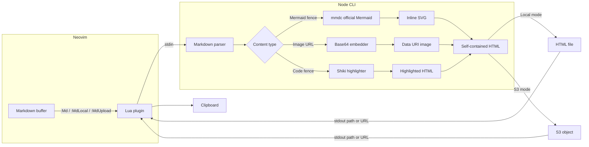

# md-preview.nvim

Render markdown buffers to self-contained HTML from Neovim. Mermaid diagrams are rendered server-side through the official Mermaid CLI (`mmdc`) and embedded as inline SVG.

## Features

- Self-contained HTML output with embedded CSS, highlighted code, Mermaid SVG, and local images
- GitHub-style Markdown features including tables and task lists
- Official Mermaid rendering via `@mermaid-js/mermaid-cli`, including modern `block-beta` syntax
- Syntax highlighting powered by Shiki
- Local file output or S3-compatible upload
- Relative markdown images resolved from the source file directory and embedded as base64 data URIs

## Requirements

- Neovim >= 0.10
- Node.js >= 20
- npm

`build.lua` runs `npm ci` and `npm run build`. The Mermaid renderer is provided by `@mermaid-js/mermaid-cli`, which uses a headless browser through its Node dependencies.

## Architecture



## Installation

Using [lazy.nvim](https://github.com/folke/lazy.nvim):

```lua
{
  "feng409/s3-md-preview.nvim",
  build = "build.lua",
  config = function()
    require("md-preview").setup({
      output_dir = vim.fn.stdpath("cache") .. "/md-preview",
    })
  end,
}
```

Full configuration with S3 upload:

```lua
{
  "feng409/s3-md-preview.nvim",
  build = "build.lua",
  config = function()
    require("md-preview").setup({
      s3 = {
        bucket = "my-bucket",
        endpoint = "https://s3.amazonaws.com",
        region = "us-east-1",
        key_prefix = "md-preview/",
        acl = "public-read",
        access_key = "MD_PREVIEW_ACCESS_KEY",
        secret_key = "MD_PREVIEW_SECRET_KEY",
      },
    })
  end,
}
```

All `s3` fields fall back to `MD_PREVIEW_*` environment variables when omitted:

```lua
{
  "feng409/s3-md-preview.nvim",
  build = "build.lua",
  opts = { s3 = {} },
}
-- export MD_PREVIEW_BUCKET, MD_PREVIEW_ENDPOINT, MD_PREVIEW_REGION,
-- MD_PREVIEW_ACCESS_KEY, MD_PREVIEW_SECRET_KEY in your shell
```

## Configuration

| Option | Type | Default | Description |
|--------|------|---------|-------------|
| `bin` | `string?` | `nil` | Path to the `md-preview` CLI. Auto-detected when unset. |
| `output_dir` | `string` | `stdpath("cache") .. "/md-preview"` | Directory for local HTML output. |
| `s3` | `table?` | `nil` | S3 upload settings. When set, `:Md` uses upload mode by default. |
| `s3.bucket` | `string?` | env `MD_PREVIEW_BUCKET` | S3 bucket name. |
| `s3.endpoint` | `string?` | env `MD_PREVIEW_ENDPOINT` | S3-compatible endpoint URL. |
| `s3.region` | `string?` | env `MD_PREVIEW_REGION` | AWS region. |
| `s3.key_prefix` | `string?` | `"md-preview/"` | Key prefix for uploaded objects. |
| `s3.acl` | `string?` | `nil` | Object ACL, for example `"public-read"`. |
| `s3.access_key` | `string?` | `"MD_PREVIEW_ACCESS_KEY"` | Env var name to read the access key ID from. |
| `s3.secret_key` | `string?` | `"MD_PREVIEW_SECRET_KEY"` | Env var name to read the secret access key from. |
| `no_proxy` | `boolean` | `true` | Clear proxy environment variables before running the CLI. |

## Usage

Open a markdown buffer and run one of:

| Command | Description |
|---------|-------------|
| `:Md` | Preview the current buffer. Uses S3 upload when `s3` is configured, otherwise writes locally. |
| `:MdLocal` | Always write HTML to `output_dir`. |
| `:MdUpload` | Always upload to S3. Requires `s3` configuration. |

On success, the output path or URL is shown and copied to the clipboard. Relative image paths like `` are resolved from the markdown file directory.

Run `:checkhealth md-preview` to verify the CLI, Node, npm, mmdc, S3 credentials, and output directory.

## CLI

The generated `md-preview` CLI can be used standalone:

```bash
# Render stdin to a local HTML file
echo "# test" | bin/md-preview --title test

# Resolve local images from a base directory
bin/md-preview --title sample --output-dir /tmp/previews --base-dir /tmp < /tmp/sample.md

# Upload to S3
export MD_PREVIEW_ACCESS_KEY="your-access-key-id"
export MD_PREVIEW_SECRET_KEY="your-secret-access-key"
bin/md-preview --title test \
  --bucket my-bucket \
  --endpoint https://s3.amazonaws.com \
  --region us-east-1 < README.md
```

## Troubleshooting

- `Node.js >= 20 is required`: install a current Node runtime and rerun the plugin build.
- `mmdc not found`: run `npm ci && npm run build` in the plugin directory.
- Mermaid render failures: run `node_modules/.bin/mmdc --version` and check headless browser availability.
- Missing local images: ensure the markdown buffer is saved so the plugin can pass its directory as `--base-dir`.
- S3 failures: verify `MD_PREVIEW_BUCKET`, `MD_PREVIEW_ENDPOINT`, `MD_PREVIEW_ACCESS_KEY`, and `MD_PREVIEW_SECRET_KEY`.

## Development

```bash
npm ci
npm test -- --run
npm run typecheck
npm run build
```

## License

MIT
