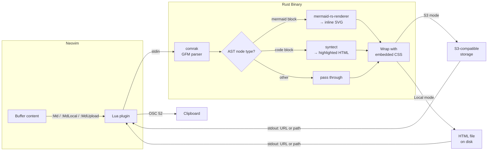

# md-preview.nvim

Render markdown to self-contained HTML with mermaid diagrams and syntax highlighting. Neovim plugin backed by a Rust binary.

## Features

- Self-contained HTML output (no CDN dependencies at view time)
- GitHub Flavored Markdown (tables, task lists, strikethrough)
- 23 Mermaid diagram types rendered server-side
- 100+ programming languages with syntax highlighting
- Local file output or S3-compatible upload
- Dark/light theme auto-detection via `prefers-color-scheme`
- Single static binary with zero runtime dependencies

## Architecture



## Requirements

- Neovim >= 0.10
- Rust toolchain (for building from source) or a pre-built binary

## Installation

Using [lazy.nvim](https://github.com/folke/lazy.nvim):

```lua
{
  "chemf/md-preview.nvim",
  build = "nvim -l build.lua",
  config = function()
    require("md-preview").setup({
      -- Minimal: local preview only
      output_dir = vim.fn.stdpath("cache") .. "/md-preview",
    })
  end,
}
```

Full configuration with S3 upload:

```lua
{
  "chemf/md-preview.nvim",
  build = "nvim -l build.lua",
  config = function()
    require("md-preview").setup({
      s3 = {
        bucket = "my-bucket",
        endpoint = "https://s3.amazonaws.com",
        region = "us-east-1",
        key_prefix = "md-preview/",
        acl = "public-read",
        -- env var names for credentials (defaults shown)
        access_key = "MD_PREVIEW_ACCESS_KEY",
        secret_key = "MD_PREVIEW_SECRET_KEY",
      },
    })
  end,
}
```

All `s3` fields fall back to `MD_PREVIEW_*` environment variables when omitted, so a minimal S3 setup is just:

```lua
{
  "chemf/md-preview.nvim",
  build = "nvim -l build.lua",
  opts = { s3 = {} },
}
-- export MD_PREVIEW_BUCKET, MD_PREVIEW_ENDPOINT, MD_PREVIEW_REGION,
-- MD_PREVIEW_ACCESS_KEY, MD_PREVIEW_SECRET_KEY in your shell
```

## Configuration

| Option | Type | Default | Description |
|--------|------|---------|-------------|
| `bin` | `string?` | `nil` | Path to the `md-preview` binary. Auto-detected when unset. |
| `output_dir` | `string` | `stdpath("cache") .. "/md-preview"` | Directory for local HTML output. |
| `s3` | `table?` | `nil` | S3 upload settings. When set, `:Md` uses upload mode by default. |
| `s3.bucket` | `string?` | env `MD_PREVIEW_BUCKET` | S3 bucket name. |
| `s3.endpoint` | `string?` | env `MD_PREVIEW_ENDPOINT` | S3-compatible endpoint URL. |
| `s3.region` | `string?` | env `MD_PREVIEW_REGION` | AWS region. |
| `s3.key_prefix` | `string?` | `"md-preview/"` | Key prefix for uploaded objects. |
| `s3.acl` | `string?` | `nil` | Object ACL (e.g. `"public-read"`). |
| `s3.access_key` | `string?` | `"MD_PREVIEW_ACCESS_KEY"` | Env var name to read the access key ID from. |
| `s3.secret_key` | `string?` | `"MD_PREVIEW_SECRET_KEY"` | Env var name to read the secret access key from. |
| `no_proxy` | `boolean` | `true` | Clear proxy environment variables before running the binary. |

## Usage

Open a markdown buffer and run one of:

| Command | Description |
|---------|-------------|
| `:Md` | Preview the current buffer. Uses S3 upload when `s3` is configured, otherwise writes locally. |
| `:MdLocal` | Always write HTML to `output_dir`. |
| `:MdUpload` | Always upload to S3 (requires `s3` configuration). |

On success, the output path or URL is shown in a notification and copied to the clipboard via OSC 52 (works over SSH).

Run `:checkhealth md-preview` to verify the binary, S3 credentials, and output directory.

## CLI

The `md-preview` binary can be used standalone:

```bash
# Render stdin to a local HTML file
echo "# test" | md-preview --title test

# Specify output directory
echo "# test" | md-preview --title test --output-dir /tmp/previews

# Upload to S3 (credentials from env vars)
export MD_PREVIEW_ACCESS_KEY="your-access-key-id"
export MD_PREVIEW_SECRET_KEY="your-secret-access-key"
echo "# test" | md-preview --title test \
  --bucket my-bucket \
  --endpoint https://s3.amazonaws.com \
  --region us-east-1
```

## License

MIT
