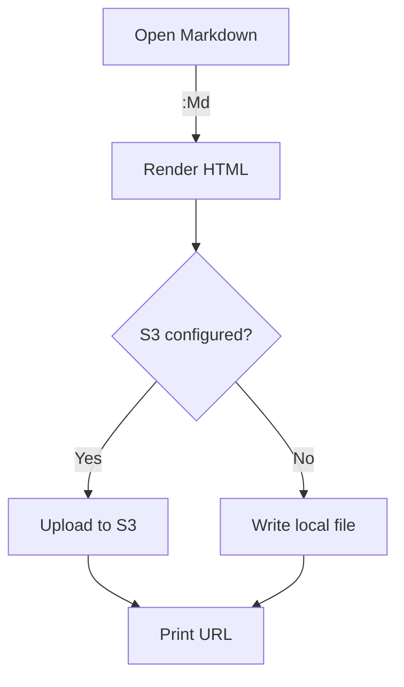
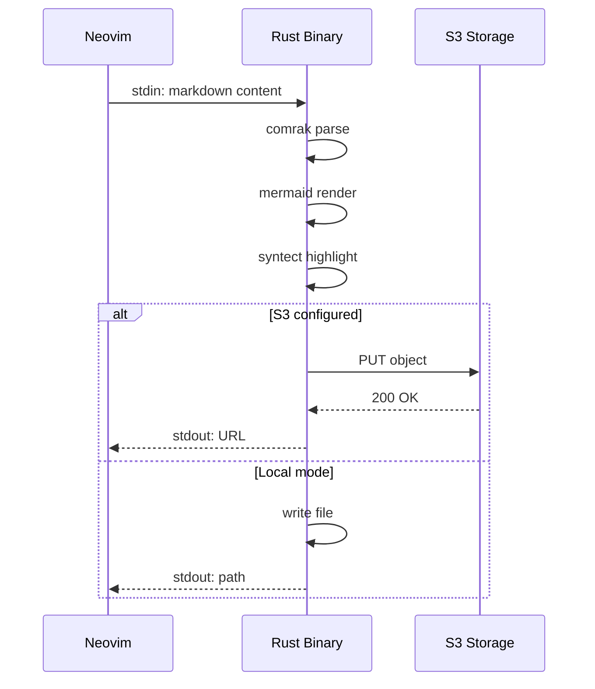

# md-preview.nvim Sample

This document demonstrates all rendering features.

## Text Formatting

Regular text, **bold**, *italic*, ~~strikethrough~~, and `inline code`.

[Link to GitHub](https://github.com)

## Table

| Feature              | Engine                | Status |
|----------------------|-----------------------|--------|
| GFM Markdown         | comrak                | Done   |
| Mermaid Diagrams     | mermaid-rs-renderer   | Done   |
| Syntax Highlighting  | syntect               | Done   |
| S3 Upload            | rust-s3               | Done   |
| Local File Output    | std::fs               | Done   |

## Code Blocks

### Rust

```rust
use std::collections::HashMap;

fn main() {
    let mut map = HashMap::new();
    map.insert("key", 42);

    for (k, v) in &map {
        println!("{k}: {v}");
    }
}
```

### Python

```python
from dataclasses import dataclass

@dataclass
class Config:
    bucket: str
    region: str = "us-east-1"

config = Config(bucket="my-bucket")
print(f"Uploading to {config.bucket}")
```

### Shell

```bash
echo "# Hello" | md-preview --title demo
# Output: /tmp/md-preview/demo.html
```

## Mermaid Diagrams

### Flowchart



### Sequence Diagram



## Task List

- [x] Render markdown to HTML
- [x] Highlight code blocks
- [x] Render mermaid to SVG
- [x] Local file output
- [x] S3 upload
- [ ] Your next feature here

## Blockquote

> md-preview.nvim: a single Rust binary that turns your markdown into
> a self-contained HTML file with zero runtime dependencies.

---

*Generated by md-preview.nvim*
