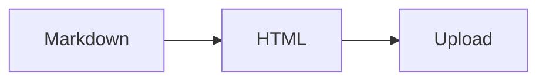

# Full Feature Test

A document exercising **all** rendering features.

## Table

| Feature    | Status |
|------------|--------|
| Markdown   | OK     |
| Mermaid    | OK     |
| Highlight  | OK     |

## Code

```rust
struct Config {
    bucket: String,
    region: String,
}
```

## Mermaid



## Blockquote

> Important note here.

## Task List

- [x] Render markdown
- [x] Highlight code
- [x] Render mermaid
- [ ] Upload to S3

---

*End of test document.*
