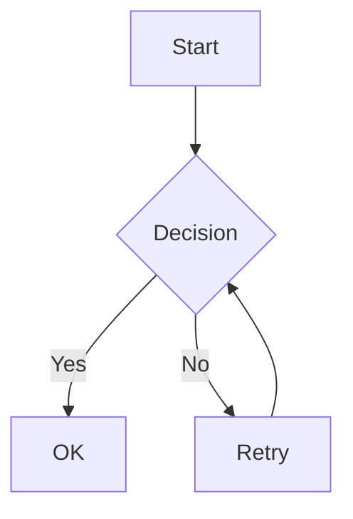
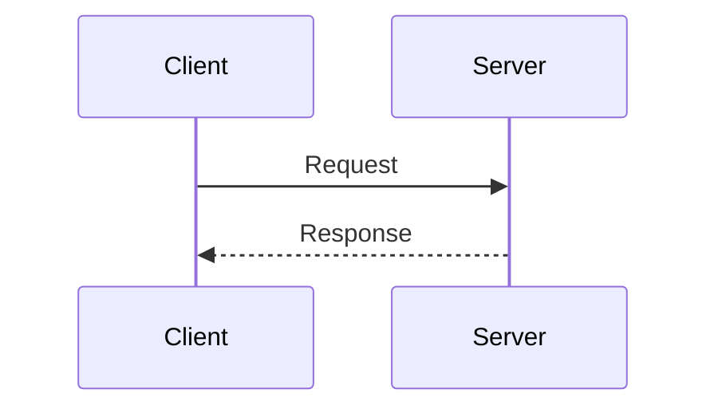

# Mermaid Diagrams

## Flowchart

```mermaid
flowchart TD
    A[Start] --> B{Decision}
    B -->|Yes| C[OK]
    B -->|No| D[Retry]
    D --> B
```

## Sequence Diagram

```mermaid
sequenceDiagram
    participant Client
    participant Server
    Client->>Server: Request
    Server-->>Client: Response
```

Some text between diagrams.
